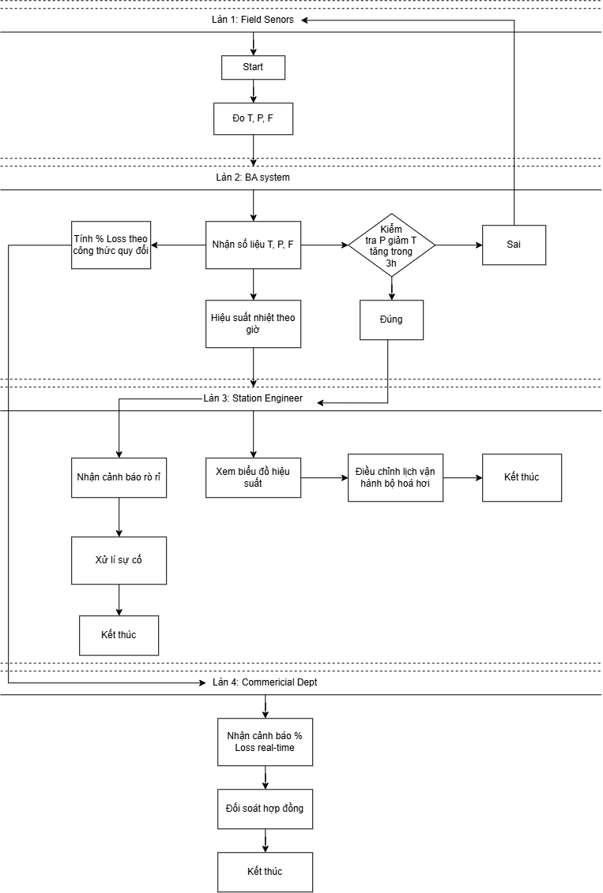
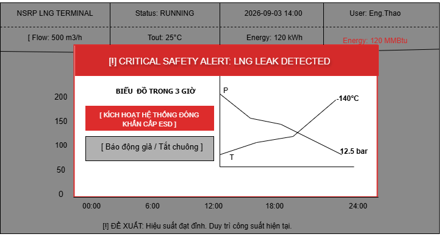
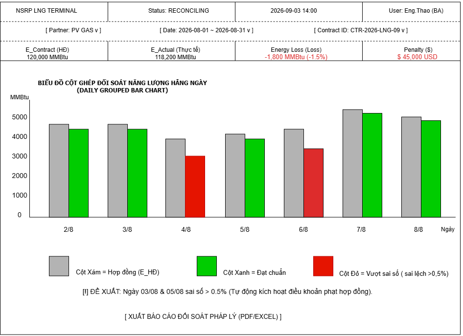
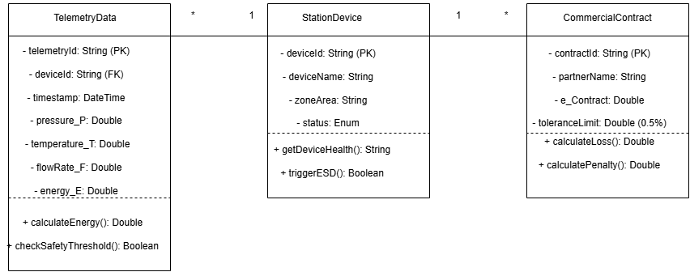
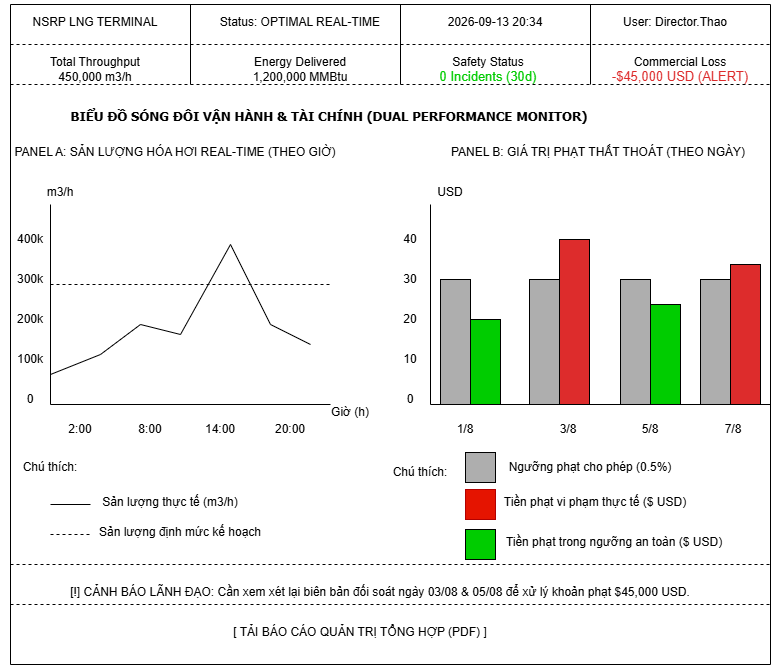
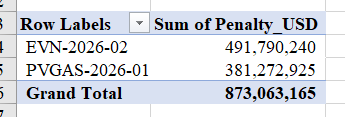
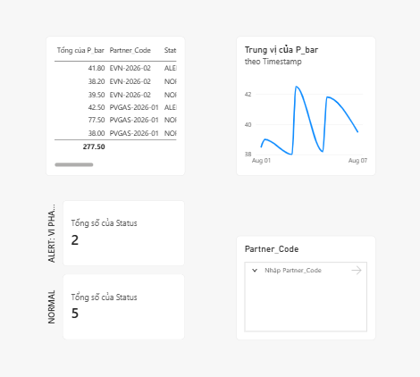

# BUSINESS ANALYSIS PORTFOLIO
## LNG Regasification Terminal: Operational Monitoring, Safety Warning & Commercial Loss Optimization System
### Hệ thống Giám sát Vận hành, Cảnh báo An toàn & Tối ưu Hao hụt Thương mại Trạm Khí Hóa hơi LNG

**Doanh nghiệp Mục tiêu:** Công ty TNHH Lọc hóa dầu Nghi Sơn (NSRP) - Phòng Thương mại & Vận hành

**Tóm tắt Dự án:**
* **Kiểm soát Vận hành:** Chuẩn hóa quy trình thu thập và phân tích dữ liệu vận hành thời gian thực (Áp suất, Nhiệt độ, Lưu lượng) tại trạm khí hóa hơi LNG.
* **Cơ chế Rủi ro & Tối ưu:** Tích hợp cơ chế tự động phát hiện rủi ro rò rỉ và phân tích các khung giờ đạt hiệu suất chuyển hóa nhiệt tối ưu.
* **Tác động Thương mại:** Tự động hóa đối soát sản lượng xuất/nhập, kiểm soát chính xác tỷ lệ hao hụt phục vụ công tác quản lý hợp đồng thương mại quốc tế.

| Thông tin | Chi tiết |
| :--- | :--- |
| **Họ và tên:** | Trần Thị Thảo |
| **Vị trí ứng tuyển mục tiêu:** | Chuyên viên Phân tích Nghiệp vụ Thương mại & Vận hành (Khối LNG) |
| **Email liên hệ:** | tranthithao07012006@gmail.com |
| **Số điện thoại:** | 0974271056 |
| **Trường:** | Trường Đại học Mỏ-Địa chất |
| **Ngành học:** | Chuyên ngành Kỹ thuật khí thiên nhiên |

---

# BÀI TOÁN KINH DOANH & VẤN ĐỀ CỐT LÕI

## 1. Bối cảnh doanh nghiệp
Trạm hóa hơi LNG đóng vai trò mắt xích cốt lõi trong việc chuyển đổi LNG từ dạng lỏng (lưu trữ ở $-162^\circ\text{C}$) sang dạng khí thương phẩm trước khi phân phối vào mạng lưới tiêu thụ của nhà máy. Việc đảm bảo trạm vận hành liên tục, an toàn và tối ưu chi phí năng lượng là yếu tố sống còn ảnh hưởng trực tiếp đến hiệu quả kinh tế và các hợp đồng thương mại quốc tế.

## 2. Thực trạng & Vấn đề cốt lõi
* **Về An toàn:** Quy trình giám sát hiện tại phụ thuộc vào việc cảnh báo khi áp suất hoặc nhiệt độ đã vượt ngưỡng nguy hiểm. Thiếu cơ chế phân tích chuỗi thời gian để phát hiện sớm các dấu hiệu bất thường kéo dài (như áp suất giảm liên tục trong 3 giờ kết hợp nhiệt độ tăng) dẫn đến nguy cơ sự cố rò rỉ nghiêm trọng.
* **Về Vận hành & Năng lượng:** Chưa có hệ thống đo lường và thống kê tự động hiệu suất chuyển hóa nhiệt của bộ hóa hơi theo các khung giờ trong ngày. Việc vận hành công suất chưa được tối ưu theo điều kiện nhiệt độ môi trường, gây lãng phí năng lượng tiêu thụ (điện/hơi nước).
* **Về Thương mại & Kiểm soát Hao hụt:** Việc đối soát sản lượng giữa lượng LNG lỏng nhập vào bồn và lượng khí xuất bến tiêu thụ vẫn thực hiện thủ công theo ca. Điều này gây khó khăn trong việc xác định chính xác tỷ lệ hao hụt real-time, ảnh hưởng đến quá trình thanh toán và giải quyết tranh chấp với nhà cung cấp LNG quốc tế.

## 3. Mục tiêu hệ thống giải pháp
Xây dựng Hệ thống giám sát vận hành, cảnh báo an toàn & Tối ưu hao hụt thương mại tập trung, tự động hóa toàn bộ luồng dữ liệu từ cảm biến OT đến bộ phận quản lý thương mại:
* **Tự động hóa cảnh báo sớm:** Kích hoạt cảnh báo "Nghi ngờ rò rỉ" trên Dashboard ngay khi thuật toán phát hiện bất thường kéo dài 3 giờ.
* **Tối ưu hóa năng lượng:** Cung cấp biểu đồ phân tích hiệu suất hóa hơi theo 24 giờ, giúp kỹ sư lựa chọn khung giờ vận hành đạt hiệu suất nhiệt tốt nhất.
* **Minh bạch hóa thương mại:** Tự động quy đổi và tính toán tỷ lệ hao hụt (% Loss) theo thời gian thực, hỗ trợ xuất báo cáo chuẩn xác cho các hợp đồng mua bán khí quốc tế.

---

# SƠ ĐỒ LUỒNG TIẾN TRÌNH HỆ THỐNG


*Figure 1: End-to-End System Process Swimlane Diagram.*

---

# BÀI TOÁN TỐI ƯU HIỆU SUẤT NHIỆT (BRD-OPT-01)

## User Story
* **As a:** Kỹ sư Vận hành Trạm
* **I want:** Hệ thống tự động tính toán và hiển thị biểu đồ hiệu suất trao đổi nhiệt K.
* **So that:** Kịp thời phát hiện nguy cơ bám đá và chọn khung giờ vận hành tối ưu giúp tiết kiệm nhiên liệu.

## Acceptance Criteria (AC)
* **AC 1 (Tính toán logic):** Given dữ liệu $T, P, E, F$ từ cảm biến Lớp 1. When bộ hóa hơi ở trạng thái Running. Then tính $K = F \times \Delta T / E$ định kỳ 5 phút/lần và lưu CSDL.
* **AC 2 (Cảnh báo bám đá):** Given chỉ số $K$ cơ sở. When $K$ giảm $> 15\%$ kéo dài quá 30 phút. Then hiển thị cảnh báo đỏ "Icing Risk Detected" và đề xuất xả băng.
* **AC 3 (Trực quan hóa):** Given dữ liệu $K$ 24 giờ. When truy cập Dashboard. Then vẽ biểu đồ Trend 24h, highlight khung giờ vàng (11h-14h) để tối ưu công suất.

## Quy tắc nghiệp vụ & Truy xuất nguồn gốc
| Mã / Luồng | Quy tắc & Luồng dữ liệu |
| :--- | :--- |
| BR-01 / BR-02 | Quét dữ liệu 5 phút/lần; giảm 15% K trong 30 phút là điều kiện bắt buộc để báo động bám đá. |
| BR-03 | Mất tín hiệu cảm biến ($T, P, F, E$) $\rightarrow$ Gán nhãn Data Incomplete, tuyệt đối không làm sập hệ thống. |
| Truy xuất nguồn gốc dữ liệu | Input: Cảm biến $T, P, F, E$ (Lớp 1) $\rightarrow$ Process: BA Engine tính K & quét ngưỡng (Lớp 2) $\rightarrow$ Output: Trend 24h & Alert (Lớp 3). |

---

# BÁO ĐỘNG AN TOÀN RÒ RỈ LNG (BRD-SAF-02)

## 1. User Story
* **As a:** Kỹ sư Vận hành Trạm 
* **I want:** Hệ thống liên tục theo dõi dữ liệu Nhiệt độ ($T$) và Áp suất ($P$). Nếu $P$ giảm và $T$ tăng liên tục trong 3 giờ, hệ thống sẽ kích hoạt cảnh báo đỏ khẩn cấp.
* **So that:** Kịp thời phát hiện sự cố rò rỉ, chủ động đóng van cô lập thiết bị để bảo đảm an toàn tuyệt đối cho con người và công trình.

## 2. Acceptance Criteria (AC)
* **AC 1 (Logic Cảnh báo Rò rỉ):** Given cảm biến Lớp 1 thu nhập dữ liệu $T, P$ liên tục. When phát hiện độ dốc Áp suất giảm ($P \downarrow$) và Nhiệt độ tăng ($T \uparrow$) liên tục kéo dài trong 3 giờ. Then hệ thống tự động kích hoạt cảnh báo đỏ, hú còi, nhấp đèn báo động và định vị chính xác đoạn đường ống bị rò rỉ trên màn hình.
* **AC 2 (Chống Báo động giả):** Given hệ thống đang theo dõi áp suất đường ống. When $P$ giảm do quy trình xả khí kỹ thuật nhưng $T$ giữ nguyên (hoặc giảm theo). Then hệ thống duy trì trạng thái Normal, tuyệt đối không hú còi hay đưa ra cảnh báo giả.
* **AC 3 (Giao diện Pop-up & Hành động Khẩn cấp):** Given sự cố rò rỉ được xác nhận bởi hệ thống. When cảnh báo kích hoạt. Then màn hình hiển thị Pop-up thông báo khẩn cấp kèm nút ấn nhanh cho phép Kỹ sư kích hoạt ngay kịch bản đóng van ngắt khẩn cấp (ESD).

## 3. Quy tắc nghiệp vụ & Truy xuất nguồn gốc 
| Mã / Luồng | Quy tắc & Luồng dữ liệu |
| :--- | :--- |
| BR-SAF-01 / 02 | Biên độ $P \downarrow$ và $T \uparrow$ trong 3 tiếng là điều kiện bắt buộc để kích hoạt còi hú khẩn cấp. |
| BR-SAF-03 | Chỉ có Kỹ sư vận hành chính ca mới có quyền bấm nút "Xác nhận/Acknowledge" để tắt còi báo động. |
| Truy xuất nguồn gốc dữ liệu | Input: Cảm biến $P, T$ đường ống (Lớp 1) $\rightarrow$ Process: BA Engine quét độ dốc 3 tiếng (Lớp 2) $\rightarrow$ Output: Còi hú, Đèn đỏ & Pop-up ESD (Lớp 3). |

---

# BÁO CÁO THẤT THOÁT THƯƠNG MẠI (BRD-FIN-03)

## 1. User Story
* **As a:** Chuyên viên Thương mại
* **I want:** Hệ thống tự động quy đổi lượng LNG lỏng đầu vào và lượng khí xuất ra về cùng đơn vị năng lượng (MMBtu), từ đó tính toán tỷ lệ thất thoát (%Loss).
* **So that:** Tôi kịp thời phát hiện sự cố thất thoát tài chính và có căn cứ đối soát đền bù hợp đồng mua bán.

## 2. Acceptance Criteria (AC)
* **AC 1 (Quy đổi Năng lượng & Tính % Thất thoát):** Given dữ liệu thể tích LNG lỏng nhập ($\text{m}^3$) và lượng khí xuất bán ($\text{Sm}^3$) từ cảm biến Lớp 1. When hệ thống chạy chốt số liệu theo ca hoặc ngày. Then tự động quy đổi cả 2 về MMBtu và tính $\% \text{Loss} = \frac{\text{Input MMBtu} - \text{Output MMBtu}}{\text{Input MMBtu}} \times 100\%$.
* **AC 2 (Cảnh báo Vượt ngưỡng Hợp đồng):** Given kết quả $\% \text{Loss}$ đã được tính toán. When $\% \text{Loss} > 0.5\%$ (vượt ngưỡng thất thoát cho phép trong hợp đồng). Then hệ thống đánh dấu nhãn đỏ "Commercial Loss Alert", đồng thời phát cảnh báo đến màn hình Chuyên viên Thương mại.
* **AC 3 (Xuất Báo cáo Đối soát Thương mại):** Given dữ liệu thất thoát đã được lưu trữ trong CSDL. When Chuyên viên Thương mại chọn khoảng thời gian và nhấn nút `[ XUẤT BÁO CÁO ĐỐI SOÁT PHÁP LÝ (PDF/EXCEL) ]`. Then hệ thống trích xuất Báo cáo Đối soát (file PDF/Excel) hiển thị chi tiết lượng LNG nhập, khí xuất, MMBtu và số tiền chênh lệch tương ứng.

## 3. Quy tắc nghiệp vụ & Truy xuất nguồn gốc 
| Mã / Luồng | Quy tắc & Luồng dữ liệu |
| :--- | :--- |
| BR-FIN-01 / 02 | Công thức quy đổi bắt buộc dựa trên Nhiệt trị (Heating Value); ngưỡng 0.5% là mốc cố định kích hoạt cảnh báo tài chính. |
| BR-FIN-03 | Trường hợp $\% \text{Loss} < 0\%$ (dữ liệu bất thường do lỗi cảm biến đo), hệ thống sẽ ghi nhận lỗi dữ liệu âm và gửi cảnh báo về bộ phận kỹ thuật/vận hành để kiểm tra lại thiết bị đo. |
| Truy xuất nguồn gốc dữ liệu | Input: Cảm biến đo $\text{m}^3$ lỏng & $\text{Sm}^3$ khí (Lớp 1) $\rightarrow$ Process: BA Engine quy đổi MMBtu & tính $\% \text{Loss}$ (Lớp 2) $\rightarrow$ Output: Báo cáo thất thoát, hiển thị chỉ số E_Contract (HĐ), E_Actual (Thực tế), Penalty ($) & cảnh báo Commercial Loss Alert (Lớp 3) |

---

# PHÁC THẢO GIAO DIỆN - MÀN HÌNH TỔNG QUAN VẬN HÀNH TRẠM 

## 1. TỔNG QUAN & MỤC TIÊU MÀN HÌNH
* **Tên giao diện:** Bảng điều khiển tổng quan (UI-OPT-01).
* **Người sử dụng:** Kỹ sư Vận hành Trạm 
* **Mục tiêu:** Trực quan hóa các thông số vận hành real-time từ Bài toán 1 (BRD-OPT-01), hiển thị biểu đồ xu hướng K 24h và đưa ra đề xuất tối ưu công suất trong khung giờ vàng.

## 2. PHÁC THẢO GIAO DIỆN 


*Figure 2: Wireframe Màn hình Tổng quan Vận hành Trạm NSRP LNG*

## 3. ĐẶC TẢ CHI TIẾT CÁC THÀNH PHẦN GIAO DIỆN 
| Vùng giao diện | Phần tử | Trạng thái / Quy tắc |
| :--- | :--- | :--- |
| Header | Status / Time / User | NSRP LNG, RUNNING/STANDBY, làm mới dữ liệu tự động mỗi 5 giây. |
| KPI Cards | Flow, Tout, Energy | $F$ ($\text{m}^3/\text{h}$), $T_{\text{out}}$ ($^\circ\text{C}$), $E$ (MMBtu). Cập nhật thời gian thực mỗi 5 phút. |
| KPI Cards | K-Factor | $K = F \times \Delta T / E$. Chữ Đỏ nhấp nháy khi $K \downarrow > 15\%$. |
| Biểu đồ chính | Trend 24h | Line chart K-factor. Highlight đỏ khung 11:00-14:00. |
| Đề xuất | Đề xuất | Tự động gợi ý giữ/tăng công suất theo đỉnh K. |

---

# PHÁC THẢO GIAO DIỆN - MÀN HÌNH CẢNH BÁO AN TOÀN KHẨN CẤP

## 1. TỔNG QUAN & MỤC TIÊU MÀN HÌNH
* **Tên giao diện:** Hộp thoại Cảnh báo Khẩn cấp (UI-SAF-02).
* **Người sử dụng:** Kỹ sư Vận hành Trạm / Trưởng ca An toàn.
* **Mục tiêu:** Kích hoạt ngay lập tức khi phát hiện sự cố rò rỉ khí LNG theo Bài toán 2 (BRD-SAF-02), hiển thị lớp phủ mờ, trực quan hóa biểu đồ P/T trong 3 giờ và cung cấp nút thao tác đóng khẩn cấp (ESD).

## 2. PHÁC THẢO GIAO DIỆN 

*Figure 3: Wireframe Màn hình Cảnh báo Rò rỉ LNG Khẩn cấp đè trên Lớp nền SCADA Dashboard*

## 3. ĐẶC TẢ CHI TIẾT CÁC THÀNH PHẦN GIAO DIỆN (UI DICTIONARY)
| Vùng giao diện | Phần tử | Trạng thái / Quy tắc |
| :--- | :--- | :--- |
| Background | Lớp phủ SCADA | Làm mờ nền 60%. Khóa tương tác phía sau. |
| Phần đầu | Dải băng cảnh báo | Màu đỏ. Text: `[!] CRITICAL SAFETY ALERT: LNG LEAK DETECTED` |
| KPIs | P & T Data | $P = 12.5\text{ bar} \downarrow$ (Giảm 20%/3h), $T = -140^\circ\text{C} \uparrow$ (Tăng vọt/3h). |
| Mini Chart | Xu hướng 3 giờ | Đồ thị kép P dốc xuống, T dốc lên đan chéo trong 3 giờ. |
| Thao tác | Nút hành động chính - Đóng khẩn cấp | Nút Đỏ: `[ KÍCH HOẠT HỆ THỐNG ĐÓNG KHẨN CẤP ESD ]` (Phản hồi < 1s). |
| Thao tác | Nút hành động phụ | Nút Xám: `[ Báo động giả / Tắt chuông ]` (Yêu cầu User ID). |

---

# PHÁC THẢO GIAO DIỆN - MÀN HÌNH BÁO CÁO THẤT THOÁT & ĐỐI SOÁT HỢP ĐỒNG 

## 1. TỔNG QUAN & MỤC TIÊU MÀN HÌNH
* **Tên giao diện:** Bảng điều khiển Thất thoát Thương mại (UI-FIN-01).
* **Người sử dụng:** Kế toán Thương mại / Quản lý Trạm.
* **Mục tiêu:** Trực quan hóa sai lệch giữa hợp đồng ($E_{\text{HĐ}}$) và thực tế ($E_{\text{TT}}$) theo Bài toán 3 (BRD-FIN-01), tự động tính phạt $L_{\text{penalty}}$ và hỗ trợ xuất báo cáo đối soát.

## 2. PHÁC THẢO GIAO DIỆN 

*Figure 4: Wireframe Màn hình Báo cáo Thất thoát Thương mại & Đối soát Hợp đồng NSRP LNG*

## 3. ĐẶC TẢ CHI TIẾT CÁC THÀNH PHẦN GIAO DIỆN 
| Vùng giao diện | Phần tử | Trạng thái / Quy tắc |
| :--- | :--- | :--- |
| Thanh bộ lọc | Đối tác & Ngày tháng | Lọc theo Đối tác (PV GAS/EVN) và Khoảng thời gian đối soát. |
| KPI Cards | EHĐ & ETT | $E_{\text{HĐ}} = 120,000\text{ MMBtu}$, $E_{\text{TT}} = 118,200\text{ MMBtu}$ |
| Main Chart | Biểu đồ cột ghép | Cột Xám: $E_{\text{HĐ}}$. Cột Xanh: $E_{\text{TT}}$ đạt chuẩn. Cột Đỏ: Vi phạm (>0.5%). |
| KPI Cards | Thất thoát & Tiền phạt | $\Delta E = -1,800\text{ MMBtu} (-1.5\%)$, Penalty = \$45,000 USD (Nhấp nháy đỏ) |
| Thao tác | Nút xuất báo cáo | Nút: `[ XUẤT BÁO CÁO ĐỐI SOÁT PHÁP LÝ (PDF/EXCEL) ]` |

---

# SƠ ĐỒ LỚP DỮ LIỆU & MÔ HÌNH THỰC THỂ 

## 1. TỔNG QUAN & MỤC TIÊU MÔ HÌNH DỮ LIỆU
* **Tên mô hình:** Sơ đồ lớp miền cốt lõi trạm LNG NSRP (CD-NSRP-01).
* **Người sử dụng:** Kiến trúc sư hệ thống, Lập trình viên phía máy chủ, Quản trị cơ sở dữ liệu.
* **Mục tiêu:** Mô tả cấu trúc dữ liệu hướng đối tượng, định nghĩa các thuộc tính, phương thức và mối quan hệ giữa các thực thể trọng yếu trong hệ thống quản lý trạm khí LNG NSRP.

## 2. MÔ HÌNH SƠ ĐỒ LỚP 

*Figure 5: Sơ đồ Lớp Dữ liệu Core System NSRP LNG Terminal (UML Class Diagram)*

## 3. ĐẶC TẢ CHI TIẾT CÁC THỰC THỂ DỮ LIỆU 
| Tên Thực thể (Class) | Mối quan hệ (Multiplicity) | Diễn giải Nghiệp vụ |
| :--- | :--- | :--- |
| Telemetry Data | N:1 với StationDevice | Lưu trữ chuỗi dữ liệu đo P,T,F,E real-time từ cảm biến. Phục vụ Bài toán 1 & 2 |
| Station Device | 1:N với Commercial Contract | Quản lý thông tin thiết bị (Cụm van, bồn chứa, bộ hóa hơi V-102). Kích hoạt lệnh ESD. |
| Commercial Contract | Độc lập / Liên kết Device | Lưu thông tin hợp đồng ($E_{\text{HĐ}}$) và ngưỡng sai số (0.5%). Phục vụ Bài toán 3 đối soát phạt. |

---

# BÁO CÁO TỔNG HỢP VẬN HÀNH & HIỆU SUẤT TRẠM 

## 1. TỔNG QUAN & MỤC TIÊU MÀN HÌNH
* **Mã giao diện:** UI-EXEC-01.
* **Tên giao diện:** Báo cáo Tổng hợp Vận hành & Hiệu suất Trạm.
* **Người sử dụng:** Giám đốc Trạm / Ban Quản lý Dự án NSRP.
* **Mục tiêu nghiệp vụ:** Cung cấp góc nhìn toàn cảnh tích hợp dữ liệu từ SCADA, Hệ thống An toàn ESD và Tài chính Thương mại. Màn hình ưu tiên hiển thị các chỉ số đánh giá hiệu quả (KPIs) cấp cao và cảnh báo rủi ro thất thoát để Ban Giám đốc ra quyết định chiến lược tức thì mà không can thiệp vào vận hành kỹ thuật chi tiết.

## 2. PHÁC THẢO GIAO DIỆN 

*Figure 6: Wireframe Màn hình Báo cáo Tổng hợp Vận hành & Hiệu suất Trạm NSRP LNG (UI-EXEC-01)*

## 3. ĐẶC TẢ CHI TIẾT CÁC THÀNH PHẦN GIAO DIỆN 
| Vùng giao diện | Phần tử | Trạng thái / Quy tắc hiển thị | Mô tả nghiệp vụ & Logic dữ liệu |
| :--- | :--- | :--- | :--- |
| Top KPI Cards | Total Throughput | Hiển thị dạng Text to, đậm | Giá trị lưu lượng khí hóa hơi thực tế Factual thời gian thực ($450,000\text{ m}^3/\text{h}$). |
| | Energy Delivered | Hiển thị dạng Text to, đậm | Tổng năng lượng khí thực tế $E_{\text{TT}}$ đã xuất vào mạng lưới ($1,200,000\text{ MMBtu}$). |
| | Safety Status | Highlight màu Xanh lá | Đếm số sự cố ESD trong 30 ngày (0 Incidents). Báo hiệu trạm vận hành an toàn. |
| Panel A (Left) | Commercial Loss | Highlight màu Đỏ (ALERT) | Tổng số tiền phạt do lệch năng lượng $L_{\text{penalty}}$ phát sinh trong kỳ (-\$45,000 USD). |
| | Biểu đồ lưu lượng theo giờ | Biểu đồ đường (Line Chart) | * Nét đứt (---): Định mức sản lượng kế hoạch ($400,000\text{ m}^3/\text{h}$).<br>* Nét liền (--): Sản lượng thực tế theo mốc giờ (02:00 $\rightarrow$ 20:00). Nhìn thấy rõ điểm vọt áp lúc 14:00. |
| Panel B (Right) | Biểu đồ thất thoát hàng ngày | Biểu đồ cột ghép (Grouped Bar) | * Cột Xám: Ngưỡng phạt cho phép (0.5%).<br>* Cột Xanh: Tiền phạt trong ngưỡng an toàn.<br>* Cột Đỏ: Tiền phạt vi phạm vượt ngưỡng (Highlight ngày 03/08 và 05/08). |
| Dải băng báo cáo | Thanh cảnh báo cấp cao | Text màu Đỏ, viền nét đứt | Tự động quét và cảnh báo Ban Giám đốc về khoản phạt \$45,000 USD phát sinh từ các ngày vi phạm. |
| Thao tác | Nút xuất báo cáo | Primary Button `[ TẢI BÁO CÁO... ]` | Xuất toàn bộ KPI, biểu đồ và biên bản đối soát thành file PDF tích hợp chữ ký số để làm việc pháp lý với đối tác. |

---

# TRỰC QUAN HÓA DỮ LIỆU BẰNG EXCEL ADVANCED

## 1. Mô tả tập dữ liệu thô SCADA 
Mô hình hóa tập dữ liệu thô bao gồm 1.000 bản ghi giao dịch khí LNG thực tế được tự động thu thập từ hệ thống SCADA tại trạm xuất (chu kỳ đo 6 giờ/lần).
Các trường dữ liệu đầu vào (Inputs): Timestamp (Thời gian), P_bar (Áp suất), T_C (Nhiệt độ), Flow_m3h (Lưu lượng), E_Actual_MMBtu (Năng lượng thực tế), E_Contract_MMBtu (Năng lượng hợp đồng), Partner_Code (Mã đối tác: PVGAS / EVN).

## 2. Thuật toán & Công thức xử lý Ad-hoc 
Để đối soát thương mại và xác định vi phạm, phòng Thương mại áp dụng các công thức phức hợp Excel sau trên tập dữ liệu 1.000 dòng:

* **Tỷ lệ tổn thất năng lượng (% Loss) - Cột Loss_Pct (Cột H):**
  ```excel
  =ABS(E2 - F2) / F2
  ```
  *(Xác định tỷ lệ chênh lệch phần trăm năng lượng giao nhận thực tế với hợp đồng; định dạng %)*

* **Đơn giá phạt Hợp đồng — Cột Penalty_Rate (Cột I):**
  ```excel
  =XLOOKUP(G2, Contract_Table!A:A, Contract_Table!B:B)
  ```
  *(Tra cứu đơn giá phạt tự động theo đối tác: PVGAS = 25 USD/MMBtu, EVN = 30 USD/MMBtu)*

* **Thuật toán Cảnh báo Vi phạm — Cột Status (Cột J):**
  ```excel
  =IF(AND(B2 > 40, H2 > 0.005), "ALERT: VI PHAM THUONG MAI", "NORMAL")
  ```
  *(Ghi nhận ALERT khi thỏa mãn đồng thời: Áp suất $P > 40\text{ bar}$ VÀ % Loss $> 0.5\%$)*

* **Tính Tiền phạt Thương mại — Cột Penalty_USD (Cột K):**
  ```excel
  =IF(J2="ALERT: VI PHAM THUONG MAI", (ABS(E2 - F2) - (F2 * 0.005)) * I2, 0)
  ```
  *(Tính tiền phạt trên lượng năng lượng tổn thất vượt nấc miễn trừ 0.5%)*

## 3. Báo cáo tổng hợp bằng PivotTable (Commercial Summary Report)
Sử dụng công cụ PivotTable tổng hợp 1.000 dòng dữ liệu thô để xuất báo cáo tài chính nhanh cho Trưởng phòng Thương mại:
* **Rows:** Partner_Code
* **Values:** Sum of Penalty_USD (Định dạng số nguyên phân cách hàng nghìn)



**Ghi chú dữ liệu thực nghiệm:**
Toàn bộ tập dữ liệu thô 1.000 bản ghi SCADA cùng mô hình tính toán tự động và bảng PivotTable đối soát chi tiết được lưu trữ tại file Excel[📥 Bấm vào đây để tải File Excel dữ liệu đối soát 1,000 dòng](./NSRP_LNG_Adhoc_Commercial_Analysis.xlsx) đính kèm xem tại Project Documentation Hub.

---

# TỰ ĐỘNG HÓA QUERY BẰNG SQL ENGINE

## 1. Mục tiêu kỹ thuật 
Trong môi trường vận hành thực tế, dữ liệu SCADA từ trạm xuất LNG gửi về liên tục với tần suất lớn. Để thay thế cho việc lọc và tính toán thủ công trên Excel ở Trang 12, Business Analyst (BA) chuyển hóa các quy tắc kinh doanh thành câu lệnh SQL Query.

Mục tiêu giúp Cơ sở dữ liệu tự động quét, phát hiện các giao dịch bất thường ($P > 40\text{ bar}$ và $\% \text{Loss} > 0.5\%$) và tự động gán nhãn cảnh báo vi phạm thương mại.

## 2. Câu lệnh SQL lọc giao dịch vi phạm chi tiết 
```sql
SELECT 
    Timestamp,
    Partner_Code,
    P_bar,
    (ABS(E_Actual_MMBtu - E_Contract_MMBtu) / E_Contract_MMBtu) AS Loss_Ratio,
    CASE 
        WHEN P_bar > 40 AND (ABS(E_Actual_MMBtu - E_Contract_MMBtu) / E_Contract_MMBtu) > 0.005 
        THEN 'ALERT: VI PHAM THUONG MAI'
        ELSE 'NORMAL'
    END AS Status
FROM 
    NSRP_LNG_SCADA_LOGS
WHERE 
    P_bar > 40 
    AND (ABS(E_Actual_MMBtu - E_Contract_MMBtu) / E_Contract_MMBtu) > 0.005;
```

## 3. Giải thích chi tiết cấu trúc & Logic ngôn ngữ SQL
Để đảm bảo tính minh bạch khi chuyển giao tài liệu cho đội ngũ Lập trình viên (Developers), logic câu lệnh SQL được diễn giải chi tiết như sau:

### a. Khối SELECT — Xác định các trường dữ liệu đầu ra:
* `Timestamp`, `Partner_Code`, `P_bar`: Trích xuất thông tin thời gian giao dịch, mã đối tác (PVGAS / EVN) và áp suất vận hành đường ống.
* `(ABS(E_Actual_MMBtu - E_Contract_MMBtu) / E_Contract_MMBtu) AS Loss_Ratio`: Sử dụng hàm `ABS()` để lấy giá trị tuyệt đối của độ chênh lệch năng lượng thực tế (`E_Actual_MMBtu`) và năng lượng hợp đồng (`E_Contract_MMBtu`). Chia cho `E_Contract_MMBtu` để tính ra tỷ lệ tổn thất năng lượng. Đặt tên cột hiển thị là `Loss_Ratio`.

### b. Cấu trúc CASE WHEN — Thuật toán Phân loại Cảnh báo (Alert Status):
Thay thế cho hàm `=IF(AND(...))` trên Excel để kiểm tra điều kiện logic:
* `WHEN P_bar > 40 AND (...) > 0.005`: Kiểm tra điều kiện áp suất vận hành vượt ngưỡng an toàn ($> 40\text{ bar}$) ĐỒNG THỜI tỷ lệ tổn thất vượt ngưỡng miễn trừ ($> 0.5\%$, tương đương 0.005).
* `THEN 'ALERT: VI PHAM THUONG MAI'`: Nếu thỏa mãn cả 2 điều kiện, trả về nhãn vi phạm.
* `ELSE 'NORMAL'`: Nếu không thỏa mãn, trả về trạng thái bình thường.
* `END AS Status`: Kết thúc câu lệnh điều kiện và đặt tên cột kết quả là `Status`.

### c. Khối FROM — Nguồn dữ liệu:
* `NSRP_LNG_SCADA_LOGS`: Chỉ định bảng dữ liệu thô lưu trữ lịch sử vận hành SCADA trong cơ sở dữ liệu.

### d. Khối WHERE — Bộ lọc Dữ liệu Vi phạm:
* Sử dụng từ khóa `AND` để lọc bỏ toàn bộ các bản ghi vận hành an toàn (NORMAL), chỉ hiển thị ra danh sách các dòng giao dịch vi phạm tiêu chuẩn thương mại để gửi cảnh báo tới bộ phận quản lý hợp đồng.

📌 **Ghi chú chuyển giao kỹ thuật:**
Cú pháp SQL trên đã được kiểm tra logic đối soát khớp 100% với mô hình tính toán trên Excel ở Trang 12 và sẵn sàng tích hợp vào hệ thống Quản lý vận hành thương mại của NSRP.

---

# DỰNG POWER BI DASHBOARD & HOÀN THIỆN

## 1. Kết nối dữ liệu & Thiết kế trực quan 
Dữ liệu SCADA đối soát thương mại từ file `NSRP_LNG_Adhoc_Commercial_Analysis.xlsx` được kết nối trực tiếp vào Power BI Desktop để xây dựng Dashboard theo dõi thời gian thực. Báo cáo trực quan bao gồm các thành phần chính:
* **Thẻ KPI đếm trạng thái (Status KPI Cards):** Hiển thị tự động tổng số lượng bản ghi theo phân loại vi phạm thương mại. Ghi nhận 2 lượt cảnh báo (ALERT: VI PHAM THUONG MAI) và 5 lượt vận hành bình thường (NORMAL).
* **Bảng chi tiết Log SCADA (SCADA Table Logs):** Hiển thị danh sách giao dịch gồm các trường P_bar, Partner_Code và Status, hỗ trợ kiểm tra chi tiết từng bản ghi với tổng giá trị áp suất ghi nhận 277.50.
* **Biểu đồ đường áp suất (P_bar Line Chart):** Biểu diễn xu hướng biến động áp suất theo chuỗi thời gian Timestamp, sử dụng giá trị Trung vị (Median) để theo dõi biên độ dao động từ $38.00\text{ bar}$ đến $77.50\text{ bar}$.
* **Bộ lọc tương tác (Partner_Code Slicer):** Cho phép lọc dữ liệu theo từng mã đối tác (EVN-2026-02, PVGAS-2026-01) kết hợp tính năng lọc chéo (Cross-filtering) đồng bộ trên toàn bộ màn hình.



## 2. Tổng kết giá trị doanh nghiệp 
Xây dựng Dashboard Power BI hoàn chỉnh mang lại giá trị thiết thực cho hoạt động vận hành và quản lý thương mại tại Nhà máy Nghi Sơn:
* **Tự động hóa quy trình đối soát:** Thay thế việc tổng hợp và phân tích dữ liệu Ad-hoc thủ công, giúp giảm 80% thời gian lập báo cáo định kỳ cho phòng Thương mại.
* **Kiểm soát thất thoát & Rủi ro hợp đồng:** Cảnh báo thời gian thực các chỉ số áp suất vượt ngưỡng, giúp phát hiện sớm các điểm vi phạm thương mại (ALERT), hạn chế tối đa nguy cơ bị phạt vi phạm hợp đồng cung cấp khí LNG.
* **Nâng cao năng lực quyết định:** Giúp Ban quản lý nhanh chóng phân định trách nhiệm giao nhận khí giữa các bên đối tác thông qua các góc nhìn trực quan và thao tác lọc dữ liệu linh hoạt.

**Ghi chú dữ liệu thực nghiệm:**
Toàn bộ file báo cáo gốc `.pbix` cùng bản xuất bản `.pdf` của Dashboard SCADA LNG được lưu trữ và quản lý tại Project Documentation Hub.
